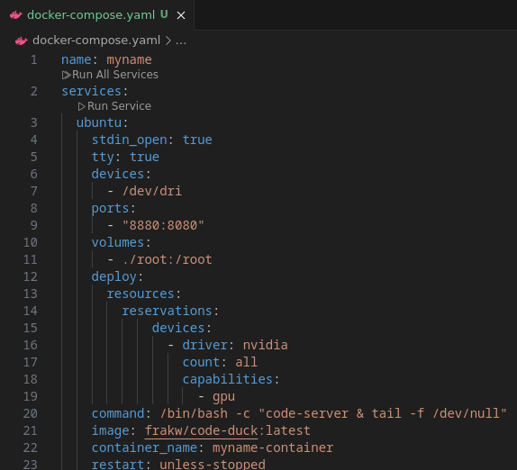
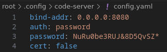
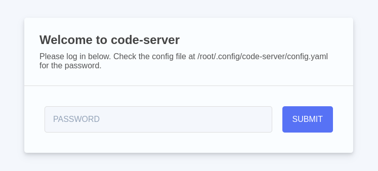
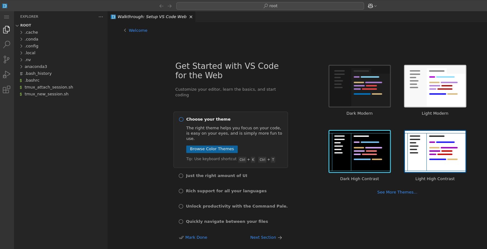
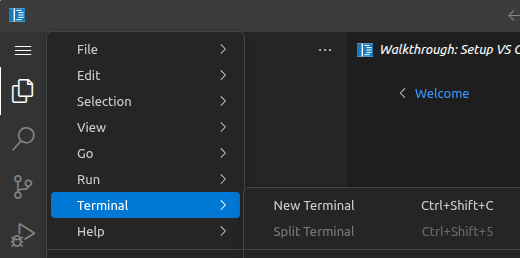
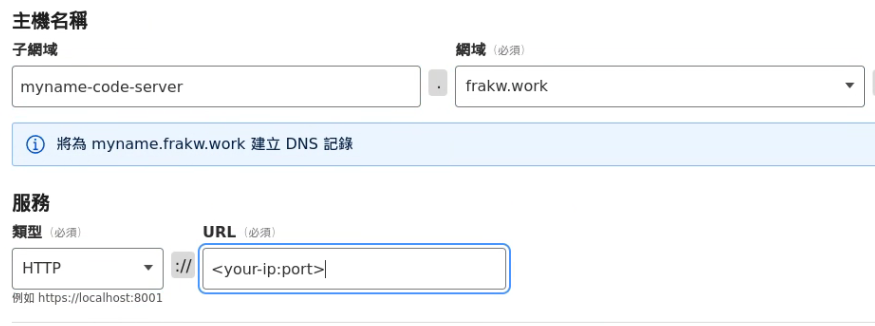

# code-duck
code-server in docker
## Prerequisite
* docker installed
* git installed
## Steps
1. Clone this repo
```console
git clone https://github.com/frakw/code-duck.git
```
2. Copy new one
```console
cp -r code-duck myname
cd myname
```
3. Config `docker-compose.yaml` \

* Change myname into the name you want
* Change the expose port 8880 into the port you want
4. Config `root/.config/code-server/config.yaml` \

* Change password into the password you want
5. Deploy docker container
```console
docker compose up -d
```
6. Access <<your-ip:port>> through browser \

* Enter the password you type before
7. Start editing you code

8. Run command in terminal

7. (optional) Add into cloudflare tunnel  \

* You should build up your cloudflare tunnel first
* Type the subdomain you want
* Select `HTTP` then enter local ip and port 